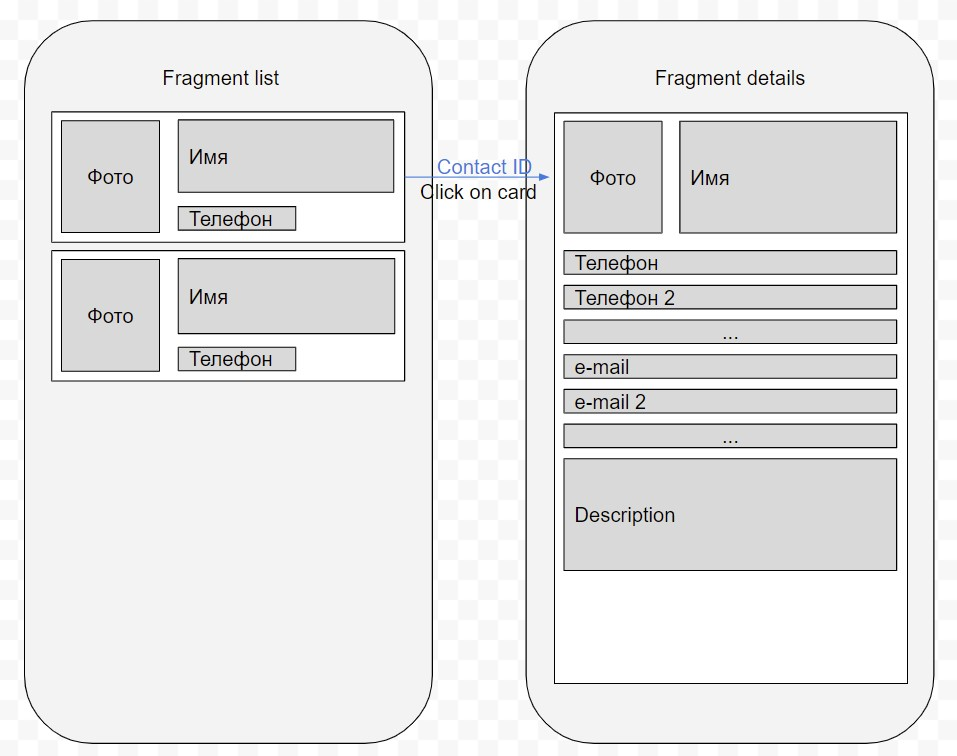

# Список контактов и детали контакта (Только верстка и навигация)

Необходимо реализовать Single Activity приложение списка контактов (Пока только верстка и навигация).

Составные компоненты (Смотрите рисунок):

- MainActivity - главная и единственная активность в приложении.

- ContactListFragment - фрагмент со списком контактов

    Короткая карточка контакта:
    - Фотография контакта
    - Имя контакта
    - Телефон контакта

При клике пользователя на карточку контакта происходит переход на фрагмент деталей контактов. Необходимо в аргументах передавать ID выбранного контакта.

- ContactDetailsFragment

    - Фотография контакта
    - Имя контакта
    - Телефон контакта
    - 2-й телефон
    - e-mail контакта
    - 2-й e-mail контакта
    - Описание контакта

На экране списка контактов пока достаточно реализовать одну карточку контакта.

Требования:
- Все должно быть выполнено аккуратно
- Кнопка "Назад" должна работать - т.е. с деталей контакта мы должны суметь вернуться обратно на список контактов
- У активности должен быть Toolbar с colorPrimary цветом
- каждый фрагмент должен менять заголовок в Toolbar: ContactListFragment -> "Список контактов", ContactDetailsFragment -> "Детали контакта"
- к заданию следует приложить ссылку на PR
- в оформлении PR необходимо приложить скриншоты 2-х экранов(Списка контактов и деталей контакта)
- цвет для colorPrimary и colorAccent необходимо сгенерировать здесь https://www.random.org/colors/hex на ваш вкус
- colorPrimaryDark сделать равным colorPrimary
- в описании к PR указать получившиеся hex цвета

 

[частые ошибки при выполнении задания](https://github.com/goblinr/AndroidLessonsCommonMistakes/blob/master/%D0%A1%D0%BF%D0%B8%D1%81%D0%BE%D0%BA_%D0%BA%D0%BE%D0%BD%D1%82%D0%B0%D0%BA%D1%82%D0%BE%D0%B2_%D0%B8_%D0%B4%D0%B5%D1%82%D0%B0%D0%BB%D0%B8_%D0%BA%D0%BE%D0%BD%D1%82%D0%B0%D0%BA%D1%82%D0%B0_%D1%82%D0%BE%D0%BB%D1%8C%D0%BA%D0%BE_%D0%B2%D0%B5%D1%80%D1%81%D1%82%D0%BA%D0%B0_%D0%B8_%D0%BD%D0%B0%D0%B2%D0%B8%D0%B3%D0%B0%D1%86%D0%B8%D1%8F.md)